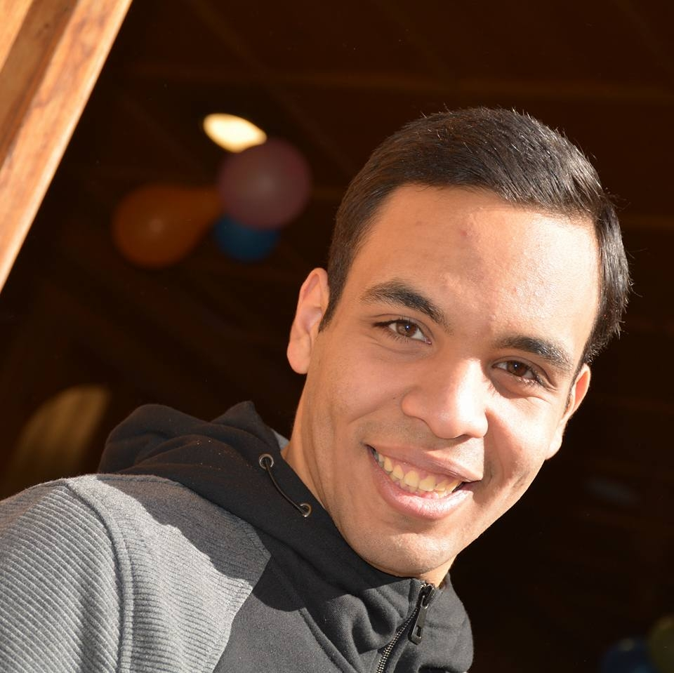

# Resume

## PERSONAL INFORMATION :

*  _**NAME**_ : Peter Emad Salah 
*  _**DATE OF BIRTH**_ : 6th April 1997 
* _**Contact Information**_:
   * E-mail: peteremad97@hotmail.com 
   * Mobile: +21222965445 

## Interests:
1. Projects 
2. Research
3. Physics 
4. Writing scenarios 
5. Programming  
6. Reading   
7. Music 

## Experience:

1. Designing of smart home and implementing of associated mobile application special for Al-zeheimar patient.
2. Designing a model for artificial iris works with required sensors.
3. Project used for transportations of vaccines associated with a mobile application.
4. A special project for patients in rehabilitation period -designed for hand rehabilitation- to make them do their excersises at home and let their doctor supervise their work remotly.
5. design circuit to measure  EMG signal and visualizing it using osclliscope. 
6. Working on a DNA allignment code in Data structure final project
7. Self learning as during this semester it was asked to make some projects and tasks which requires a very wide knowledge in many aspects. 
8. How to get the best output in no time. 
9. How to work under pressure. 
10. Social and educational activities in the church. 
11. Great experience in organizing concerts and special days in the church.
12. volunteer in religious educations for preparatory age 
13. Great experience in Data structure - you can find what we learned here https://sbme-tutorials.github.io/2018/data-structures/data-structures.html

## Knowledge :
 **Title** | **Date** 
 --------- | -------- 
 C++ | 2018 
 C++ OOP | 2018 
 C programming | 2017 
 LabView | 2018 
 Arduino | 2018 
 MatLab  | 2018
 VHDL | 2018
 maquette designing | 2018
 Visual basic | 2016
 python | 2018 - 2019 
 
## Education:
 * Undergraduate in the third year at *Systems & Biomedical Engineering Department \- Cairo University*

### secondary school
* **Finished in** : june 2015  
* **total year grade Percentage** : 99 % 
* **Mark** : 405.5 / 410 
* **Note** : this grade qualified me to enroll in faculty of engineering El-Mansoura university

### Faculty of engineering
* _**Preparatory year**_ : 
   * Finished in El-Mansoura University 
   * Grade : Excellent 
   * Note  : this grade qualified me move to Cairo University - Faculty of Engineering - Systems and Biomedical   Engineering department.
*  _**Frist year**_ :
    * Finished in Cairo university
    * Grade : Excellent
    * Rank : Fifth 
*  _**Second year**_ :
    * Finished in Cairo university 
    * Grade : : Excellent
    * Rank : ninth  
        

## Skills:
 * Research
 * Actor 
 * Director 
 * Background music designer 
 * Powerpoint, Word
 * Self learning
 * Presentation skills 
 * Fast learning of something that may I did not know anything about it.

## More information and achievment

You can find more data ,reports represnting my projects and recpmmpdation letters  
**Here** : https://github.com/petemad/CV-and-My-achievments.git 